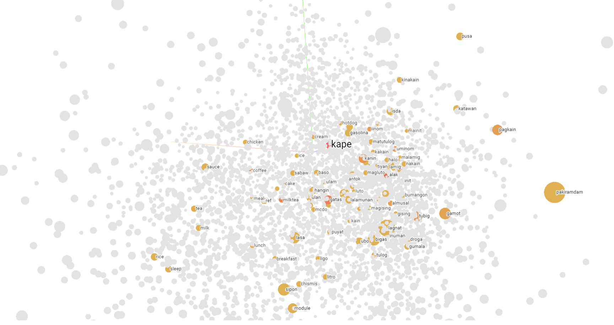

# Filipino Word Embeddings


This repository contains download links to pretrained static word embeddings in Filipino.

## Corpus Information
The training corpus comprises texts from Tagalog Wikipedia, news articles, and tweets.
The corpus contains texts in Filipino and Taglish (code-switching between Tagalog/Filipino and English).

### Data Source
Combination of the following:
* [WikiText-TL-39](https://github.com/jcblaisecruz02/Filipino-Text-Benchmarks#datasets)
* [NewsPH-NLI](https://github.com/jcblaisecruz02/Filipino-Text-Benchmarks#datasets)
* Unpublished Twitter dataset

### Preprocessing Rules
* Retain stop words
* Retain commas
* Lowercase text
* Removed quotes and its contents
* Removed brackets, parenthesis, braces, and its contents
* Removed punctuations
* Removed symbols
* Replace numbers with `xx_digit`
* Replace amounts with `xx_amount`
* Replace percentages with `xx_percentage`

### Corpus Statistics
After preprocessing, the corpus have:
* 4.68 million sentences
* 14.28 average sentence length
* 66.9 million tokens
* 1.08 million unique tokens

## Models
### Training setup
The Python library to train word2vec (Skip-Gram with Negative Sampling) and fastText is `gensim v4.1.2`. 
Default hyperparameters of gensim v4.1.2 were used except for `min_count` which is the minimum number of frequency for the word or token to be retained in the vocabulary. The `min_count` is set to 10 instead of 5 which means that words or tokens that appear less than 10 times in the whole training corpus will be excluded from the vocabulary and will be treated as "unknown word". Both models were trained for 20 epochs.

### Download via link
| Model    | Dimensions | Vocab Size | Google Drive ID                   | Download URL (Size) |
|----------|------------|------------|-----------------------------------|---------------------|
| word2vec | 300        | 126,687    | 1-aG85UarQmQaxsiPnKa8ZQwww6_6gj5U | [link](https://drive.google.com/file/d/1-aG85UarQmQaxsiPnKa8ZQwww6_6gj5U/view?usp=sharing) (269.9 MB)                    |
| word2vec | 200        | 126,687    | 1-bMzQKykfsYLGqVVvkj08gcYaFbexlwY | [link](https://drive.google.com/file/d/1-bMzQKykfsYLGqVVvkj08gcYaFbexlwY/view?usp=sharing) (180.2 MB)                    |
| word2vec | 100        | 126,687    | 1-cQcqryrDYzjKSOY5-NUAgvb6S797QsI | [link](https://drive.google.com/file/d/1-cQcqryrDYzjKSOY5-NUAgvb6S797QsI/view?usp=sharing) (90.7 MB)                    |
| fastText | 300        | 126,687    | 1-fhjOrPYLynSKnAXiZtpAMZd2Uahf4mo | [link](https://drive.google.com/file/d/1-fhjOrPYLynSKnAXiZtpAMZd2Uahf4mo/view?usp=sharing) (2.34 GB)                    |
| fastText | 200        | 126,687    | 1-hO2uWwsc1pgw99BJ67LcF0sD21DMbQq | [link](https://drive.google.com/file/d/1-hO2uWwsc1pgw99BJ67LcF0sD21DMbQq/view?usp=sharing) (1.55 GB)                    |
| fastText | 100        | 126,687    | 1-l9KEKNfilYlNAEl1EpBbu10nROcRtgJ | [link](https://drive.google.com/file/d/1-l9KEKNfilYlNAEl1EpBbu10nROcRtgJ/view?usp=sharing) (797.4 MB)                    |

### Download via terminal
```
# Example: download word2vec (300 dimensions)

# Install gdown (if not yet installed)
pip install gdown

# Download data to current directory (you can get the id from the table above)
gdown --id 1-aG85UarQmQaxsiPnKa8ZQwww6_6gj5U

# Extract/Unzip to current directory
unzip word2vec_300dim_20epochs.zip
```

### How to load and use the model (word2vec)
```
# Example: load word2vec (300 dimensions)

# Import dependencies
from gensim.models import Word2Vec

# Load model
model = Word2Vec.load("word2vec_300dim_20epochs.model")

# Get embeddings for the word 'manila'
model.wv['manila']

# Get top 10 nearest neighbors of the word 'manila'
model.wv.most_similar('manila', topn=10)
```

### How to load and use the model (fastText)
```
# Example: load fastText (300 dimensions)

# Import dependencies
from gensim.models import FastText

# Load model
model = Word2Vec.load("fasttext_300dim_20epochs.model")

# Get embeddings for the word 'manila'
model.wv['manila']

# Get top 10 nearest neighbors of the word 'manila'
model.wv.most_similar('manila', topn=10)
```


## Example notebook (model usage example, evaluation, visualization)
You can explore the embeddings through this [notebook from repo](https://github.com/danjohnvelasco/Filipino-Word-Embeddings/blob/main/example_notebook.ipynb) or view it at [Google Colab](https://colab.research.google.com/drive/1mQhsPnI1m2d82ThNrzQmhMNRntxFkhx8?usp=sharing) 😊

Contents:
* How to download the model
* How to load the model
* Evaluation scripts
    * Nearest neighbors + 2D plots
    * Word analogy
    * Categorization (concept clustering) + 2D plots
* 3D interactive plot of embedding space (Tensorboard)

## Notes
These models/embeddings are not examined for biases. These models were trained for research and/or educational purposes. Please use with caution.
